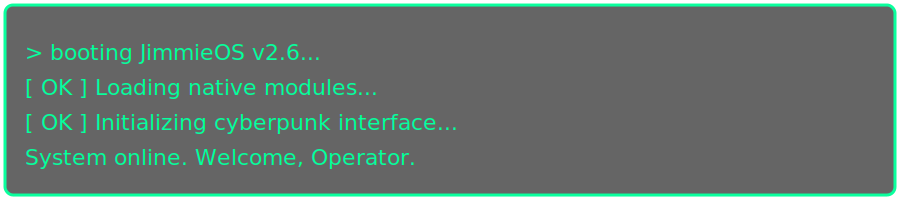

# NeiSep

> You didn’t land on a profile.  
> You connected to a running system.

---

## Boot sequence

**Status:** `OFFLINE`  <br>
**Location:** `Sweden`<br>
**Mode:** `Deep work // Low noise // High signal`<br><br>

```text
> init system --profile=neisep --target=craftsmanship
[ OK ] Loading: native tools, Rust, Linux, clean UIs
[ OK ] Mounting: long-term thinking, financial independence, quiet summers
[ OK ] Disabling: bloatware, lock-in, electron-everywhere
System ready.
```
<pre>
Currently running processes

Probe – ultra-fast REST client
    Rust + egui
    .http files as first-class citizens

Git client experiment – 15 MB, native, fast
    No Electron
    Startup time and memory as hard constraints

Release notes
v2026.04 – “Stability & Recovery”
    Running at ~50% capacity to prioritize long-term health
    Sustainable routines
    Rebuilding energy for the next decade
    
Planned features
    Agent-first dev workflows
    CLI-first AI tooling
    Summer mode for deep projects
</pre>

<pre>
Known issues
    Perfectionism vs shipping
    Impatience with bloat
</pre>

<pre>
> shutdown -h now

System will remain available via:
- Issues
- Discussions
- Pull requests
- Quiet, thoughtful collaboration
</pre>


💀 Over and out
